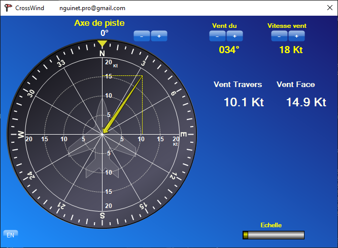

# CROSSWIND

C# Winforms application to compute wind component (heading & crosswind) for aeronautical activities.

## Compilation

Open the solution in Visual Studio.
Press F5

## Usage

Setting runway heading
>Use the buttons or click & Move or double-click on the compas 

Setting the wind
>Click and Move to set the wind

## Contributing

Wow, thanks to contribute to this project!   
New ideas, samples, forks...are welcome.  
So please just fork it, commit, push and send me a pull request to main.  

## License

This project is licensed under the [MIT License](LICENSE)